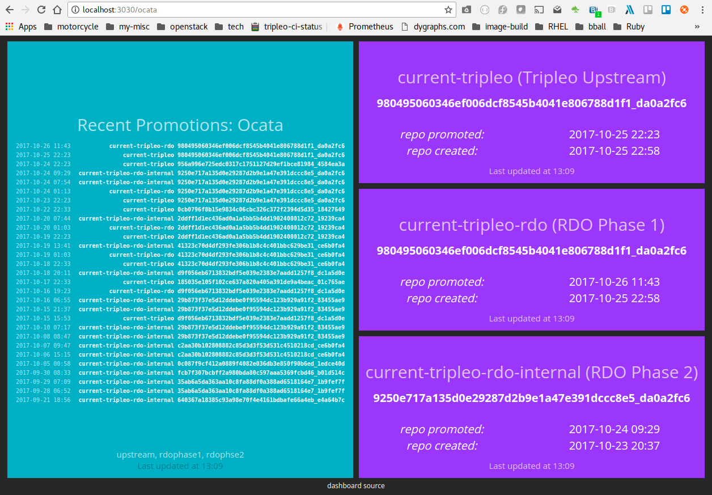
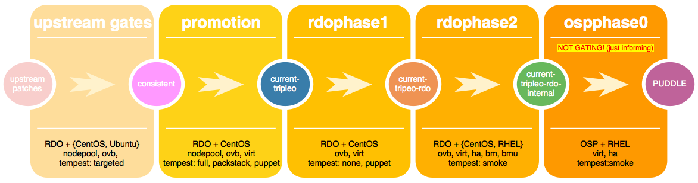

# What is this?

The dashboard will query the [RDO delorean api](https://github.com/softwarefactory-project/DLRN/blob/master/doc/api_definition.yaml) using [dlrnapi_client](https://github.com/softwarefactory-project/dlrnapi_clienthttps://github.com/softwarefactory-project/dlrnapi_client) every 15 minutes.

It will show status of Ocata, Pike, and Master branches.



##### What is current-tripleo?  current-tripleo-rdo? current-tripleo-rdo-internal?


 

# installation directions

This has been tested on Fedora 26 and RHEL 7.4

##### Install dependencies needed to get rolling.

```
sudo dnf groupinstall 'Development Tools'
sudo dnf install git ruby ruby-devel rubygem-json nodejs gcc-c++
gem install --user-install bundler
gem install --user-install smashing
```

##### bundle (install ruby deps)

```bash
git clone https://github.com/halcyondude/delorean-metrics.git
cd delorean-metrics/dlrnapi-dashboard
bundle
```

##### The output should look like the following.  

_note: Don't panic!  The first time you bundle, there will be spam from gems being installed._

```
[you@yourbox dlrnapi-dashboard] $ bundle
[matyoung@myoung-lap dlrnapi-dashboard] $ bundle
The latest bundler is 1.16.0.pre.3, but you are currently running 1.16.0.pre.2.
To install the latest version, run `gem install bundler --pre`
Using public_suffix 3.0.0
Using addressable 2.5.2
Using backports 3.10.3
Using buftok 0.2.0
Using bundler 1.16.0.pre.2
Using coffee-script-source 1.12.2
Using execjs 2.0.2
Using coffee-script 2.2.0
Using daemons 1.2.5
Using unf_ext 0.0.7.4
Using unf 0.1.4
Using domain_name 0.5.20170404
Using equalizer 0.0.11
Using ffi 1.9.18
Using ethon 0.11.0
Using eventmachine 1.2.5
Using multipart-post 2.0.0
Using faraday 0.11.0
Using hike 1.2.3
Using http-cookie 1.0.3
Using http-form_data 1.0.3
Using http_parser.rb 0.6.0
Using http 2.2.2
Using json 2.1.0
Using thread_safe 0.3.6
Using memoizable 0.4.2
Using multi_json 1.12.2
Using naught 1.1.0
Using rack 1.5.5
Using rack-protection 1.5.3
Using rack-test 0.7.0
Using typhoeus 1.3.0
Using ruby_dlrnapi 1.0.0 from https://github.com/halcyondude/ruby_dlrnapi.git (at master@ab830dc)
Using tzinfo 1.2.3
Using rufus-scheduler 2.0.24
Using sass 3.2.19
Using simple_oauth 0.3.1
Using tilt 1.4.1
Using sinatra 1.4.8
Using sinatra-contrib 1.4.7
Using sprockets 2.10.2
Using thin 1.6.4
Using thor 0.20.0
Using smashing 1.0.0
Using twitter 6.1.0
Bundle complete! 3 Gemfile dependencies, 45 gems now installed.
Use `bundle info [gemname]` to see where a bundled gem is installed.

```

##### Now start your dashboard!

```bash
smashing start
```

The dashboard uses [Thin](https://github.com/macournoyer/thin), which can be run in [other ways (background, arbitrary ports, etc)](https://github.com/Smashing/smashing/wiki/How-To:-Run-on-a-different-port,-or-in-production) .

Point your favorite browser at: http://localhost:3030

# Notes:

- feed-dashboard.log will be created and has the full debug output.
- history.yml is what the dashboard uses as a cache.  If you're hacking on this and getting unexpected behaviors, nuke that.
- RubyMine, WebStorm, and PyCharm are all very useful.
- Check out the [http://smashing.github.io](http://smashing.github.io) for more information.

# Contributing

Pull requests are welcome as are github issues.

Also feel free to ping me directly:

- email: myoung@redhat.com
- IRC (freenode): myoung
